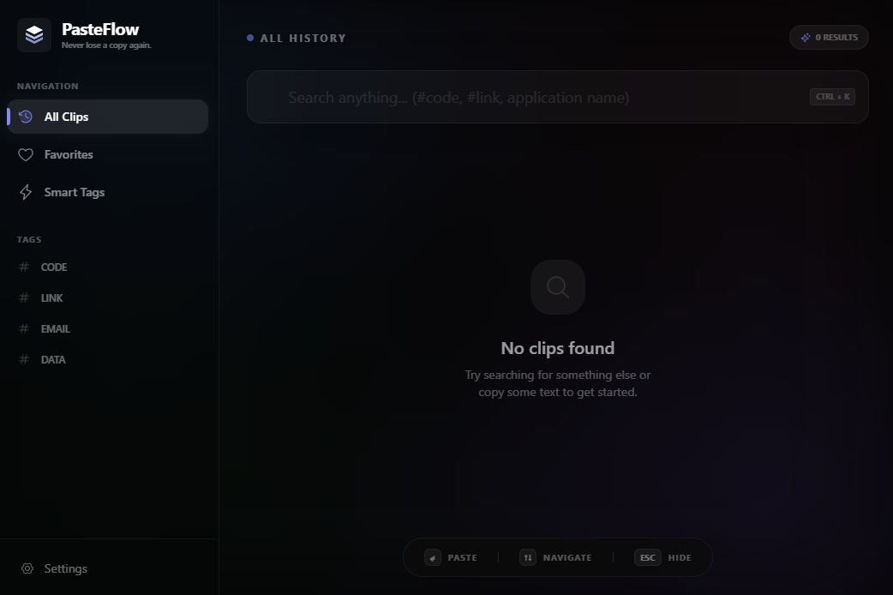

# 💎 PasteFlow

**Never lose a copy again.** PasteFlow is a premium, keyboard-first clipboard manager built for speed and visual excellence.



## ✨ Features

- **🚀 Instant History**: Access your last 100+ copies instantly with `Alt + V`.
- **🏷️ Smart Tags**: Automatically categorizes your clips into **#Code**, **#Link**, **#Email**, and **#Data**.
- **❤️ Favorites**: Star your most important snippets for quick access anytime.
- **🔍 Power Search**: Fuzzy search through your entire history by content or application name.
- **🎨 Glassmorphism UI**: A stunning, modern interface with real-time theme reactivity and backdrop blurs.
- **📦 Native Experience**: Deeply integrated into Windows with a custom `.ico`, system tray, and native notifications.

## ⌨️ Keyboard Shortcuts

| Action | Shortcut |
| :--- | :--- |
| **Toggle Window** | `Alt + V` |
| **Search** | `Ctrl + K` |
| **Navigate** | `↑` / `↓` |
| **Paste & Hide** | `Enter` |
| **Hide Window** | `Esc` |

## 🛠️ Development

### Prerequisites
- Node.js (v18+)
- npm

### Setup
```bash
# Install dependencies
npm install

# Run in development mode
npm run dev
```

### Build
```bash
# Build for Windows
npm run build:win
```

## 🛡️ Privacy
PasteFlow stores all your data locally on your machine in a secure SQLite database. No data ever leaves your device.
